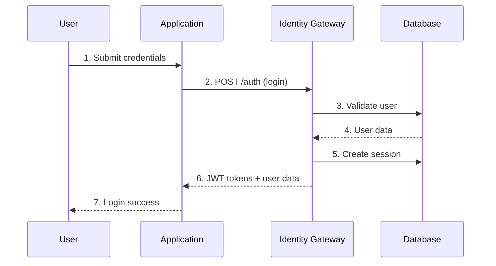
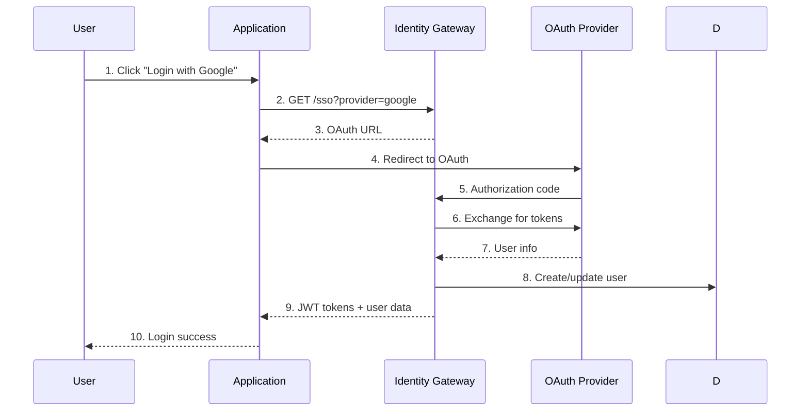

# 🚀 Centralized Identity Gateway - Developer Guide

## 📋 Table of Contents

1. [Overview](#overview)
2. [Quick Start](#quick-start)
3. [Authentication Flow](#authentication-flow)
4. [API Reference](#api-reference)
5. [SDK Integration](#sdk-integration)
6. [SSO Integration](#sso-integration)
7. [Error Handling](#error-handling)
8. [Security Best Practices](#security-best-practices)
9. [Examples](#examples)
10. [Troubleshooting](#troubleshooting)

---

## 🎯 Overview

The Centralized Identity Gateway provides a unified authentication and authorization system for all applications in your ecosystem. It supports:

- **🔐 JWT-based Authentication**
- **🌐 Single Sign-On (SSO)**
- **👥 User Management**
- **🔑 Role-Based Access Control**
- **📊 Session Management**
- **🛡️ Security Monitoring**

### **Key Benefits**

- ✅ **Single Source of Truth** - One user database for all apps
- ✅ **Cross-Application SSO** - Login once, access all apps
- ✅ **Centralized Security** - Unified security policies and monitoring
- ✅ **Scalable Architecture** - Built for enterprise-scale applications
- ✅ **Developer Friendly** - Simple REST API with comprehensive documentation

---

## ⚡ Quick Start

### **1. Register Your Application**

```bash
POST /api/admin/identity/applications
{
  "name": "My Application",
  "slug": "my-app",
  "type": "web",
  "url": "https://myapp.com",
  "callbackUrls": ["https://myapp.com/auth/callback"],
  "allowedOrigins": ["https://myapp.com"],
  "settings": {
    "allowRegistration": true,
    "requireEmailVerification": true,
    "defaultRole": "user"
  }
}
```

### **2. Get Your Credentials**

```bash
POST /api/admin/identity/applications
# Response includes:
{
  "application": {
    "clientId": "my-app-client-id",
    "clientSecret": "my-app-client-secret"
  }
}
```

### **3. Implement Authentication**

```javascript
// Frontend Example
const login = async (email, password) => {
  const response = await fetch('/api/admin/identity/auth', {
    method: 'POST',
    headers: { 'Content-Type': 'application/json' },
    body: JSON.stringify({
      action: 'login',
      clientId: 'my-app-client-id',
      email,
      password,
      deviceInfo: {
        device: 'Desktop',
        browser: 'Chrome',
        os: 'Windows'
      }
    })
  })
  
  const { user, tokens } = await response.json()
  localStorage.setItem('token', tokens.accessToken)
  return user
}
```

---

## 🔄 Authentication Flow

### **Standard Login Flow**



### **SSO Login Flow**



---

## 📚 API Reference

### **Authentication Gateway**

#### **POST `/api/admin/identity/auth`**

Main authentication endpoint supporting multiple actions.

**Login**
```json
{
  "action": "login",
  "clientId": "your-client-id",
  "email": "user@example.com",
  "password": "password123",
  "deviceInfo": {
    "device": "Desktop",
    "browser": "Chrome",
    "os": "Windows",
    "userAgent": "Mozilla/5.0..."
  },
  "rememberMe": false
}
```

**Response**
```json
{
  "success": true,
  "user": {
    "id": "user-uuid",
    "email": "user@example.com",
    "firstName": "John",
    "lastName": "Doe",
    "role": "user",
    "permissions": ["content:read", "profile:write"]
  },
  "tokens": {
    "accessToken": "jwt-token",
    "refreshToken": "refresh-token",
    "expiresIn": 604800,
    "tokenType": "Bearer"
  },
  "session": {
    "id": "session-uuid",
    "expiresAt": "2024-01-15T10:30:00Z"
  }
}
```

**Register**
```json
{
  "action": "register",
  "clientId": "your-client-id",
  "email": "newuser@example.com",
  "password": "password123",
  "firstName": "Jane",
  "lastName": "Smith",
  "acceptTerms": true
}
```

**Token Refresh**
```json
{
  "action": "refresh",
  "clientId": "your-client-id",
  "refreshToken": "refresh-token"
}
```

**Logout**
```json
{
  "action": "logout",
  "clientId": "your-client-id",
  "accessToken": "jwt-token",
  "allSessions": false
}
```

**Verify Token**
```json
{
  "action": "verify",
  "clientId": "your-client-id",
  "accessToken": "jwt-token"
}
```

### **SSO Endpoints**

#### **GET `/api/admin/identity/sso`**

Initiate SSO login with external provider.

**Query Parameters**
- `provider`: google, github, microsoft
- `clientId`: Your application client ID
- `redirectUri`: Callback URL (optional)
- `state`: CSRF protection token (optional)

**Response**
```json
{
  "success": true,
  "authUrl": "https://accounts.google.com/oauth/authorize?...",
  "state": "random-state-string"
}
```

#### **POST `/api/admin/identity/sso`**

Complete SSO authentication with authorization code.

**Request**
```json
{
  "provider": "google",
  "code": "authorization-code",
  "state": "random-state-string",
  "clientId": "your-client-id"
}
```

**Response**
```json
{
  "success": true,
  "user": {
    "id": "user-uuid",
    "email": "user@gmail.com",
    "firstName": "John",
    "lastName": "Doe",
    "avatar": "https://lh3.googleusercontent.com/..."
  },
  "tokens": {
    "accessToken": "jwt-token",
    "refreshToken": "refresh-token",
    "expiresIn": 604800
  }
}
```

### **User Management**

#### **GET `/api/admin/users`**

Get users with pagination and filtering.

**Query Parameters**
- `page`: Page number (default: 1)
- `limit`: Items per page (default: 20)
- `search`: Search by email, name
- `role`: Filter by role
- `isActive`: Filter by active status

**Response**
```json
{
  "success": true,
  "users": [...],
  "pagination": {
    "page": 1,
    "limit": 20,
    "total": 150,
    "totalPages": 8
  }
}
```

#### **POST `/api/admin/users`**

Create new user.

**Request**
```json
{
  "email": "newuser@example.com",
  "firstName": "Jane",
  "lastName": "Smith",
  "role": "user",
  "isActive": true,
  "sendWelcomeEmail": true
}
```

### **Roles & Permissions**

#### **GET `/api/admin/identity/roles`**

Get all available roles.

**Response**
```json
{
  "success": true,
  "roles": [
    {
      "id": "role-uuid",
      "name": "Admin",
      "slug": "admin",
      "description": "Full system access",
      "permissions": ["*"],
      "isSystem": true,
      "userCount": 5
    }
  ]
}
```

#### **GET `/api/admin/identity/permissions`**

Get all available permissions.

**Query Parameters**
- `module`: Filter by module (users, content, settings, etc.)

**Response**
```json
{
  "success": true,
  "permissions": [
    {
      "id": "users:read",
      "module": "users",
      "action": "read",
      "description": "View users"
    }
  ],
  "modules": ["users", "content", "settings"]
}
```

---

## 🔧 SDK Integration

### **JavaScript/TypeScript SDK**

```typescript
// Install the SDK
npm install @your-org/identity-sdk

// Initialize
import { IdentityGateway } from '@your-org/identity-sdk'

const identity = new IdentityGateway({
  clientId: 'your-client-id',
  baseUrl: 'https://your-identity-gateway.com',
  autoRefresh: true
})

// Login
const user = await identity.login({
  email: 'user@example.com',
  password: 'password123'
})

// Get current user
const currentUser = await identity.getCurrentUser()

// Check permissions
const canReadUsers = await identity.hasPermission('users:read')

// Logout
await identity.logout()
```

### **React Integration**

```tsx
import { IdentityProvider, useAuth } from '@your-org/identity-react'

function App() {
  return (
    <IdentityProvider clientId="your-client-id">
      <Dashboard />
    </IdentityProvider>
  )
}

function Dashboard() {
  const { user, login, logout, isAuthenticated } = useAuth()
  
  if (!isAuthenticated) {
    return <LoginForm onLogin={login} />
  }
  
  return (
    <div>
      <h1>Welcome, {user.firstName}!</h1>
      <button onClick={logout}>Logout</button>
    </div>
  )
}
```

### **Backend Integration**

```python
# Python SDK
from identity_sdk import IdentityGateway

identity = IdentityGateway(
    client_id='your-client-id',
    base_url='https://your-identity-gateway.com'
)

# Verify token from request headers
user = identity.verify_token(request.headers.get('Authorization'))

# Check permissions
if identity.has_permission(user.id, 'users:read'):
    # Allow access
    pass
```

---

## 🌐 SSO Integration

### **Google OAuth Setup**

1. **Create Google OAuth App**
   - Go to Google Cloud Console
   - Create new OAuth 2.0 Client ID
   - Add authorized redirect URIs

2. **Configure in Identity Gateway**
```bash
POST /api/admin/identity/sso-providers
{
  "name": "Google",
  "type": "oauth2",
  "config": {
    "clientId": "your-google-client-id",
    "clientSecret": "your-google-client-secret",
    "authUrl": "https://accounts.google.com/oauth/authorize",
    "tokenUrl": "https://oauth2.googleapis.com/token",
    "userInfoUrl": "https://www.googleapis.com/oauth2/v2/userinfo",
    "scope": "openid email profile"
  }
}
```

3. **Implement in Your App**
```javascript
const handleGoogleLogin = async () => {
  const response = await fetch('/api/admin/identity/sso?provider=google&clientId=your-client-id')
  const { authUrl } = await response.json()
  
  // Redirect to Google
  window.location.href = authUrl
}

// Handle callback
const handleCallback = async (code, state) => {
  const response = await fetch('/api/admin/identity/sso', {
    method: 'POST',
    headers: { 'Content-Type': 'application/json' },
    body: JSON.stringify({
      provider: 'google',
      code,
      state,
      clientId: 'your-client-id'
    })
  })
  
  const { user, tokens } = await response.json()
  localStorage.setItem('token', tokens.accessToken)
  return user
}
```

---

## ⚠️ Error Handling

### **Standard Error Response Format**

```json
{
  "success": false,
  "error": "Error message",
  "code": "ERROR_CODE",
  "details": {
    "field": "email",
    "message": "Invalid email format"
  },
  "timestamp": "2024-01-15T10:30:00Z",
  "requestId": "req-uuid"
}
```

### **Common Error Codes**

| Code | Description | HTTP Status |
|------|-------------|-------------|
| `INVALID_CREDENTIALS` | Invalid email or password | 401 |
| `USER_NOT_FOUND` | User does not exist | 401 |
| `ACCOUNT_DISABLED` | User account is disabled | 403 |
| `TOKEN_EXPIRED` | JWT token has expired | 401 |
| `INVALID_TOKEN` | Invalid JWT token | 401 |
| `INSUFFICIENT_PERMISSIONS` | User lacks required permission | 403 |
| `RATE_LIMIT_EXCEEDED` | Too many requests | 429 |
| `VALIDATION_ERROR` | Request validation failed | 400 |

### **Error Handling Best Practices**

```javascript
try {
  const response = await identity.login(credentials)
  return response.user
} catch (error) {
  if (error.code === 'INVALID_CREDENTIALS') {
    showError('Invalid email or password')
  } else if (error.code === 'ACCOUNT_DISABLED') {
    showError('Your account has been disabled')
  } else {
    showError('Login failed. Please try again.')
  }
  throw error
}
```

---

## 🛡️ Security Best Practices

### **1. Token Management**

```javascript
// Store tokens securely
const tokenStorage = {
  set: (token) => {
    // Use httpOnly cookies in production
    if (typeof window !== 'undefined') {
      localStorage.setItem('token', token)
    }
  },
  get: () => {
    return localStorage.getItem('token')
  },
  clear: () => {
    localStorage.removeItem('token')
  }
}

// Auto-refresh tokens
const autoRefresh = async () => {
  const token = tokenStorage.get()
  if (!token) return
  
  try {
    const payload = JSON.parse(atob(token.split('.')[1]))
    if (payload.exp * 1000 < Date.now() - 300000) { // 5 minutes before expiry
      const newToken = await identity.refreshToken()
      tokenStorage.set(newToken.accessToken)
    }
  } catch (error) {
    tokenStorage.clear()
    window.location.href = '/login'
  }
}
```

### **2. Request Security**

```javascript
// Add security headers to API requests
const secureRequest = async (url, options = {}) => {
  const token = tokenStorage.get()
  
  return fetch(url, {
    ...options,
    headers: {
      'Content-Type': 'application/json',
      'Authorization': `Bearer ${token}`,
      'X-Client-ID': clientId,
      ...options.headers
    }
  })
}
```

### **3. CSRF Protection**

```javascript
// Generate and validate CSRF tokens
const generateCSRFToken = () => {
  return crypto.randomUUID()
}

const validateCSRFToken = (token, sessionToken) => {
  // Implement token validation logic
  return token === sessionToken
}
```

---

## 💡 Examples

### **Complete Login Flow**

```javascript
class AuthService {
  constructor(clientId) {
    this.clientId = clientId
    this.baseUrl = process.env.IDENTITY_GATEWAY_URL
  }
  
  async login(email, password, rememberMe = false) {
    try {
      const response = await fetch(`${this.baseUrl}/api/admin/identity/auth`, {
        method: 'POST',
        headers: { 'Content-Type': 'application/json' },
        body: JSON.stringify({
          action: 'login',
          clientId: this.clientId,
          email,
          password,
          deviceInfo: this.getDeviceInfo(),
          rememberMe
        })
      })
      
      if (!response.ok) {
        const error = await response.json()
        throw new Error(error.error || 'Login failed')
      }
      
      const { user, tokens, session } = await response.json()
      
      // Store tokens
      localStorage.setItem('accessToken', tokens.accessToken)
      localStorage.setItem('refreshToken', tokens.refreshToken)
      
      // Set up auto-refresh
      this.setupTokenRefresh(tokens.expiresIn)
      
      return { user, session }
    } catch (error) {
      console.error('Login error:', error)
      throw error
    }
  }
  
  async logout(allSessions = false) {
    try {
      const token = localStorage.getItem('accessToken')
      
      await fetch(`${this.baseUrl}/api/admin/identity/auth`, {
        method: 'POST',
        headers: { 
          'Content-Type': 'application/json',
          'Authorization': `Bearer ${token}`
        },
        body: JSON.stringify({
          action: 'logout',
          clientId: this.clientId,
          accessToken: token,
          allSessions
        })
      })
    } catch (error) {
      console.error('Logout error:', error)
    } finally {
      // Clear local storage
      localStorage.removeItem('accessToken')
      localStorage.removeItem('refreshToken')
    }
  }
  
  getDeviceInfo() {
    return {
      device: /Mobile|Tablet/i.test(navigator.userAgent) ? 'Mobile' : 'Desktop',
      browser: this.getBrowserName(),
      os: this.getOSName(),
      userAgent: navigator.userAgent
    }
  }
  
  setupTokenRefresh(expiresIn) {
    const refreshTime = (expiresIn - 300) * 1000 // 5 minutes before expiry
    
    setTimeout(async () => {
      try {
        await this.refreshToken()
        this.setupTokenRefresh(expiresIn) // Schedule next refresh
      } catch (error) {
        console.error('Token refresh failed:', error)
        this.logout()
      }
    }, refreshTime)
  }
  
  async refreshToken() {
    const refreshToken = localStorage.getItem('refreshToken')
    
    const response = await fetch(`${this.baseUrl}/api/admin/identity/auth`, {
      method: 'POST',
      headers: { 'Content-Type': 'application/json' },
      body: JSON.stringify({
        action: 'refresh',
        clientId: this.clientId,
        refreshToken
      })
    })
    
    const { tokens } = await response.json()
    localStorage.setItem('accessToken', tokens.accessToken)
    localStorage.setItem('refreshToken', tokens.refreshToken)
    
    return tokens
  }
}

// Usage
const auth = new AuthService('your-client-id')

// Login
const { user } = await auth.login('user@example.com', 'password123')

// Logout
await auth.logout()
```

### **Permission-Based Component**

```tsx
import { useAuth } from './hooks/useAuth'

function AdminPanel() {
  const { user, hasPermission } = useAuth()
  
  if (!hasPermission('admin:access')) {
    return <AccessDenied />
  }
  
  return (
    <div>
      <h1>Admin Panel</h1>
      {hasPermission('users:read') && <UserList />}
      {hasPermission('settings:write') && <SettingsForm />}
    </div>
  )
}

function useAuth() {
  const [user, setUser] = useState(null)
  const [permissions, setPermissions] = useState([])
  
  useEffect(() => {
    // Load user and permissions
    loadUserData()
  }, [])
  
  const hasPermission = (permission) => {
    return permissions.includes('*') || permissions.includes(permission)
  }
  
  return { user, hasPermission }
}
```

---

## 🔧 Troubleshooting

### **Common Issues**

#### **1. "Invalid token" errors**

**Cause:** Token expired or malformed
**Solution:** Implement auto-refresh and proper token validation

```javascript
const validateToken = (token) => {
  try {
    const payload = JSON.parse(atob(token.split('.')[1]))
    return payload.exp * 1000 > Date.now()
  } catch {
    return false
  }
}
```

#### **2. CORS errors**

**Cause:** Origin not allowed in application settings
**Solution:** Add your domain to allowed origins

```bash
POST /api/admin/identity/applications
{
  "allowedOrigins": ["https://yourapp.com", "http://localhost:3000"]
}
```

#### **3. Rate limiting**

**Cause:** Too many requests from same IP
**Solution:** Implement exponential backoff

```javascript
const retryWithBackoff = async (fn, maxRetries = 3) => {
  for (let i = 0; i < maxRetries; i++) {
    try {
      return await fn()
    } catch (error) {
      if (error.code === 'RATE_LIMIT_EXCEEDED' && i < maxRetries - 1) {
        const delay = Math.pow(2, i) * 1000
        await new Promise(resolve => setTimeout(resolve, delay))
        continue
      }
      throw error
    }
  }
}
```

### **Debug Mode**

Enable debug logging for development:

```javascript
const identity = new IdentityGateway({
  clientId: 'your-client-id',
  debug: true, // Enables console logging
  logLevel: 'verbose'
})
```

### **Health Check**

Monitor the gateway health:

```bash
GET /api/health

Response:
{
  "status": "healthy",
  "timestamp": "2024-01-15T10:30:00Z",
  "version": "1.0.0",
  "services": {
    "database": "connected",
    "redis": "connected",
    "jwt": "operational"
  }
}
```

---

## 📞 Support

### **Documentation**
- [API Reference](./api-reference.md)
- [SDK Documentation](./sdk-docs.md)
- [Security Guidelines](./security.md)

### **Community**
- [GitHub Discussions](https://github.com/your-org/identity-gateway/discussions)
- [Stack Overflow](https://stackoverflow.com/questions/tagged/identity-gateway)

### **Contact**
- Email: identity-support@yourorg.com
- Slack: #identity-gateway
- Status Page: https://status.yourorg.com

---

## 📄 License

This project is licensed under the MIT License - see the [LICENSE](LICENSE) file for details.

---

**Happy coding! 🚀**

For questions or support, please don't hesitate to reach out to our development team.
